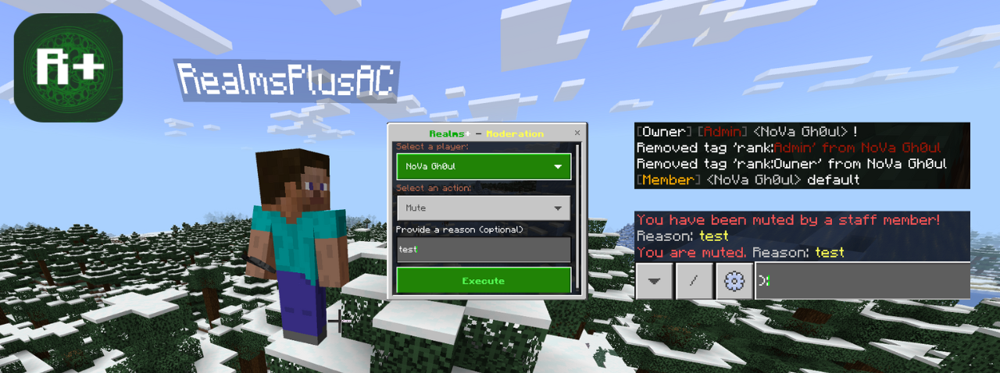

# 🌍 World Integration - Realms+ Bridge
**Realms+ Bridge** allows for real time communication between a Minecraft Bedrock Realm and our Discord Automod bot. This addon also has built in support for the **NoMoreChatSpam** pack.

You can find the latest version available for download [here](https://github.com/All-Realms-Are-Safe/realmsplus-bridge/releases)

> The addon is meant to be used alongside Realms+, however it can function by itself for basic chat ranks and spam protection

[](https://discord.com/oauth2/authorize?client_id=1169402081006845972)  [](https://discord.gg/aras)




## Features
- **Chat Ranks** - Decorates your realm chat.
- **Anti-Spam** - Detects and mitigates spam messages.
- **Anti Auto Clicker** - Prevents automated clicking exploits.
- **Player Management** - Allows muting and unmuting players.
- **View Player Inventory** - Retrieves and displays player inventory contents.
- **Command Block Logging** - Notifies when and where a command block was placed in your world.

---
## Setup + Requirements
1. [Download](https://github.com/All-Realms-Are-Safe/realmsplus-bridge/releases) the latest release
2. Apply the behavior/resource packs to your realm(s)
    - Turn Beta API's on
3. Configure the pack In Game or from Discord (if you're using our discord bot)
    - In Game: give yourself `admin` tag, right click a compass
    - Discord: `/config bridge` has all the config options
---

## Script Events Sent by the Bot (INBOUND)

### `realmsplus:configUpdate`
Sends JSON data to update the world database (`worldDB`).

### `realmsplus:lookupPlayer`
Requests a lookup for a specific player in the database and returns their stored model if found.

---

## Tellraw Messages Sent to the Bot (OUTBOUND)

### `eventId: realmsplus.configUpdate`
Confirms that a `configUpdate` request has been processed successfully.

### `eventId: realmsplus.lookupPlayer`
Returns the requested player model data.

### `eventId: realmsplus.blockPlaced`
Sends information about specific block placements (e.g., command blocks). Example payload:
```js
bridge.outboundEvent({
    eventId: "realmsplus.blockPlaced",
    data: {
        username: player.name,
        block: block.typeId,
        location: block.location,
        dimension: dimension.id
    }
});
```

---

## Bridge Class Implementation
The **Bridge** class facilitates communication between the Minecraft world and the external bot. It includes event management, outbound messaging, and world data synchronization.

### Key Components
  - Handles incoming script events.
  - Sends outbound events to the Realms+ bot.
  - Synchronizes stored player models every 10 seconds.

### Example Usage
```javascript
import { world } from "@minecraft/server";
import { bridge } from "./Bridge";

world.beforeEvents.chatSend.subscribe((event) => {
    const { message, sender } = event;
    bridge.outboundEvent({ eventId: "realmsplus.chatSend", data: { message: `${sender.name} said: ${message}` } });
});
```
